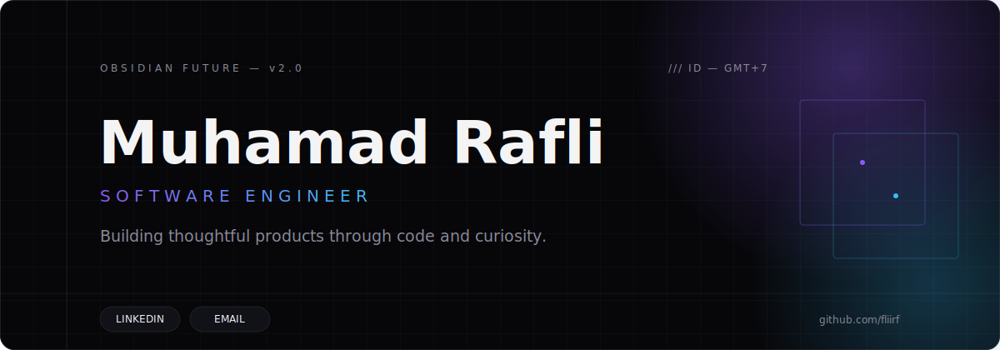
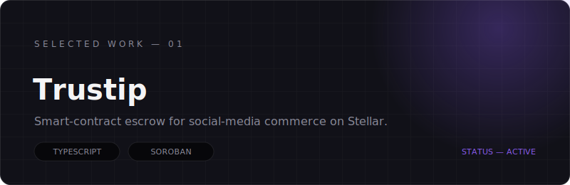
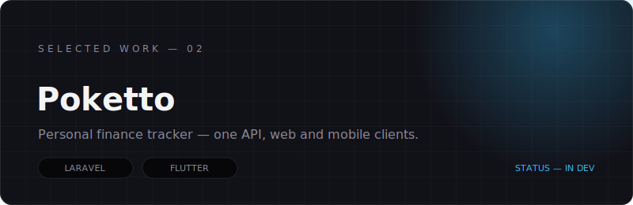
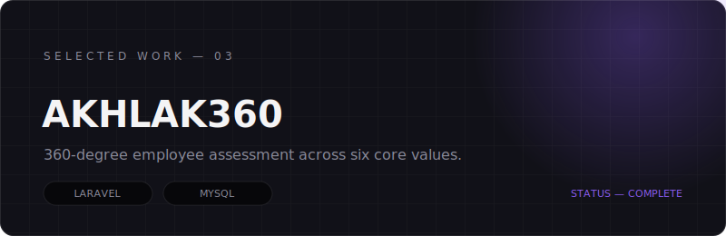

<p align="center">
  <a href="https://www.linkedin.com/in/muhamadrafli843/"></a>
  <a href="mailto:mhdrflii843@gmail.com"></a>
</p>

<br />

## About

I enjoy turning ideas into digital products that feel useful, intentional, and enjoyable to use. My work spans different areas of technology, but I am always driven by the same thing: understanding problems and building thoughtful solutions.

`Based in Indonesia · Open to collaborations · Always exploring`

<br />

## Selected Work

<table>
  <tr>
    <td width="50%">
      <a href="https://github.com/fliirf/Trustip"></a>
      <p><strong>Trustip</strong><br />
      Blockchain escrow for social-media commerce — USDC stays locked in a Soroban smart contract until the buyer confirms delivery.<br />
      <sub>Role: Solo developer · Tech: TypeScript, Next.js, Rust (Soroban), Stellar, Supabase · Status: Active</sub></p>
    </td>
    <td width="50%">
      <a href="https://github.com/fliirf/poketto"></a>
      <p><strong>Poketto</strong><br />
      Personal finance tracker monorepo — one Laravel REST API serving a Next.js web app and a Flutter mobile app.<br />
      <sub>Role: Solo developer · Tech: Laravel, Next.js, Flutter, PostgreSQL · Status: In development</sub></p>
    </td>
  </tr>
  <tr>
    <td width="50%">
      <a href="https://github.com/fliirf/akhlak360"></a>
      <p><strong>AKHLAK360</strong><br />
      360-degree employee assessment system evaluating staff across six core values with multi-perspective feedback.<br />
      <sub>Role: Solo developer · Tech: PHP, Laravel, MySQL, Chart.js · Status: Complete (academic MVP)</sub></p>
    </td>
    <td width="50%"></td>
  </tr>
</table>

<br />

## Contributions

<div align="center">
  
</div>

<br />

## Selected Technologies

**Currently Building With**

<p>
  
  
  
  
  
  
</p>

**Exploring**

<p>
  
  
  
  
</p>

<br />

## Currently

```text
Building    Digital products and developer tools
Exploring   Machine learning and decentralized technologies
Learning    Better system design and product thinking
```

<br />

## Contact

<p>
  <a href="https://www.linkedin.com/in/muhamadrafli843/"></a>
  <a href="mailto:mhdrflii843@gmail.com"></a>
</p>

<br />

<p align="center">
  <sub><code>OBSIDIAN FUTURE</code> · Designed and built by Muhamad Rafli</sub>
</p>
