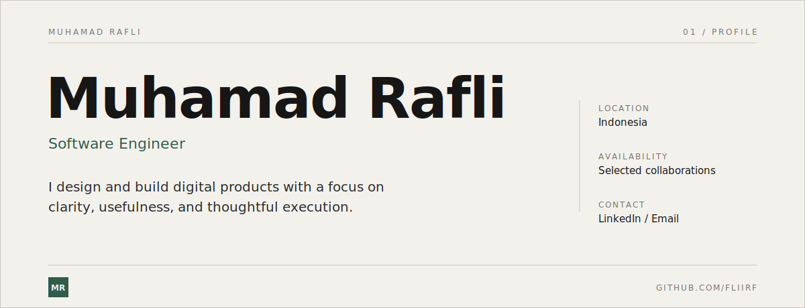
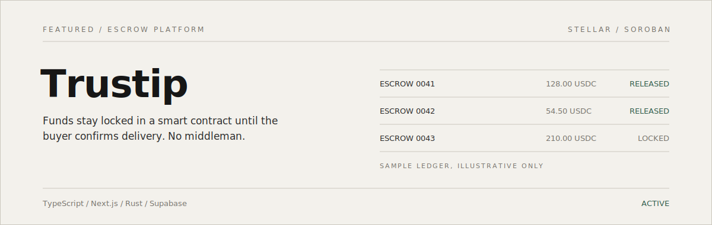
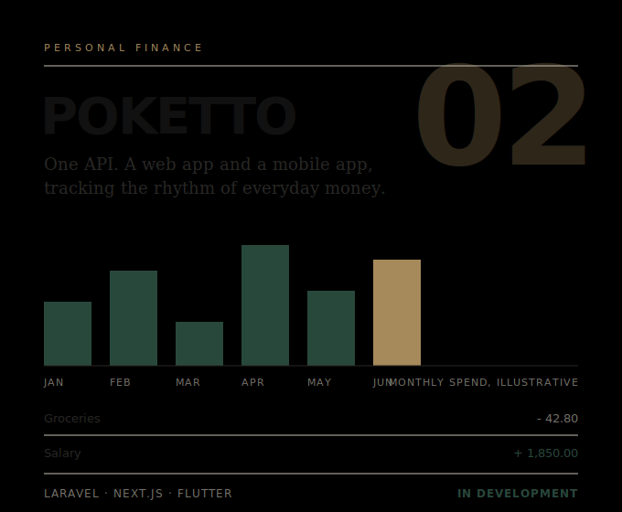
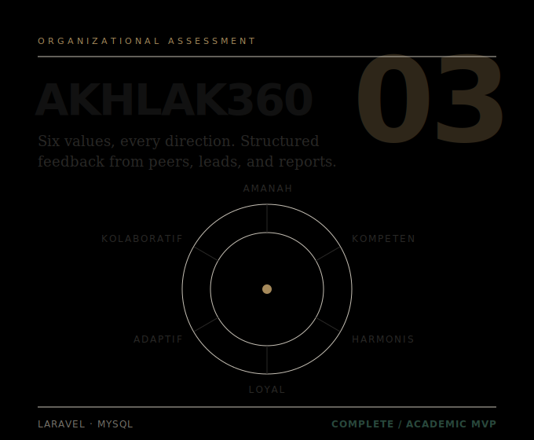

 

## 02 / About

I enjoy turning ideas into digital products that feel useful, intentional, and enjoyable to use. My work spans different areas of technology, but I am always driven by the same thing: understanding problems and building thoughtful solutions.

 

## 03 / Selected Work

**Trustip** · Escrow platform · Solo developer · [Repository](https://github.com/fliirf/Trustip)
Peer-to-peer commerce on social media, with USDC locked in a Soroban smart contract until the buyer confirms delivery.

<table>
  <tr>
    <td width="50%" valign="top">
      
      
<strong>Poketto</strong> · Finance tool · Solo developer · <a href="https://github.com/fliirf/poketto">Repository</a> 
      One Laravel API serving a Next.js web app and a Flutter mobile app.

    </td>
    <td width="50%" valign="top">
      
      
<strong>AKHLAK360</strong> · Assessment system · Solo developer · <a href="https://github.com/fliirf/akhlak360">Repository</a> 
      360-degree employee evaluation across six core values, with multi-perspective feedback.

    </td>
  </tr>
</table>

 

## 04 / Contributions

 

## 05 / Selected Tools

| | | |
|---|---|---|
| TypeScript | React | Next.js |
| Laravel | PHP | Flutter |
| PostgreSQL | MySQL | Rust / Soroban |

 

## 06 / Current Focus

| | |
|---|---|
| **Building** | Digital products and developer tools |
| **Exploring** | Machine learning and decentralized systems |
| **Learning** | Better system design and product thinking |

 

## 07 / Contact

Open to thoughtful projects, collaborations, and conversations.

[LinkedIn](https://www.linkedin.com/in/muhamadrafli843/) / [Email](mailto:mhdrflii843@gmail.com)

 

Muhamad Rafli · github.com/fliirf
