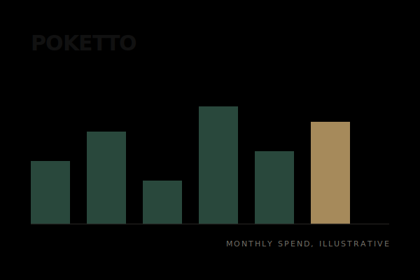
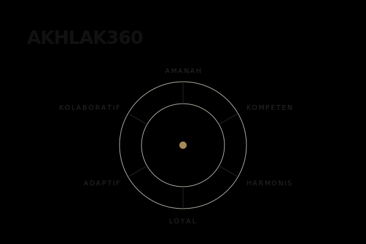

[LinkedIn](https://www.linkedin.com/in/muhamadrafli843/) · [Email](mailto:mhdrflii843@gmail.com)

## About

I enjoy turning ideas into digital products that feel useful, intentional, and enjoyable to use. My work spans different areas of technology, but I am always driven by the same thing: understanding problems and building thoughtful solutions.

`Based in Indonesia · Open to collaborations · Always exploring`

## Selected Work

### Trustip

Blockchain escrow for social-media commerce. A Soroban smart contract holds USDC and releases it only when the buyer confirms delivery, so no middleman ever touches the funds.

`TypeScript · Next.js · Rust · Soroban · Stellar · Supabase`

[View repository →](https://github.com/fliirf/Trustip)

 

<table>
  <tr>
    <td width="50%" valign="top">
      
      <h4>Poketto</h4>
      
Personal finance tracker. One Laravel API serving a Next.js web app and a Flutter mobile app.

      
<code>Laravel · Next.js · Flutter · PostgreSQL</code>

      
<a href="https://github.com/fliirf/poketto">View repository →</a> · In development

    </td>
    <td width="50%" valign="top">
      
      <h4>AKHLAK360</h4>
      
360-degree employee assessment across six core values, with multi-perspective feedback.

      
<code>Laravel · MySQL · Chart.js</code>

      
<a href="https://github.com/fliirf/akhlak360">View repository →</a> · Complete, academic MVP

    </td>
  </tr>
</table>

## Activity

## Selected Tools

**Frontend**  
TypeScript · React · Next.js · Flutter

**Backend & Data**  
Laravel · PHP · PostgreSQL · MySQL

**Systems & Emerging**  
Rust · Soroban · Stellar

## Current Focus

**Building** · Digital products and developer tools  
**Exploring** · Machine learning and decentralized systems  
**Learning** · System design and product thinking

## Let's build something thoughtful.

Open to selected projects, collaborations, and conversations.

[LinkedIn](https://www.linkedin.com/in/muhamadrafli843/) · [Email](mailto:mhdrflii843@gmail.com)
