<p align="center">
  
</p>

<br />

```console
$ whoami
software engineer. i build digital products and iterate on them
step by step. the best part is the process: solving problems,
experimenting with ideas, shipping things people actually use.

$ cat focus
blockchain / ml·ai / full-stack / mobile
```

<br />

<p align="center">
  
  
</p>

<p align="center">
  
</p>

<div align="center">
  
</div>

<br />

<h3 align="center">stack</h3>

<p align="center">
  
  
  
  
  
  
  
</p>
<p align="center">
  
  
  
  
  
  
  
</p>
<p align="center">
  
  
  
  
  
  
  
  
</p>

<br />

<h3 align="center">reach</h3>

<p align="center">
  <a href="https://www.linkedin.com/in/muhamadrafli843/">
    
  </a>
  &nbsp;
  <a href="mailto:mhdrflii843@gmail.com">
    
  </a>
</p>

<br />

<p align="center">
  <sub><code>~ nothing here, on purpose ~</code></sub>
  <br />
  
</p>


